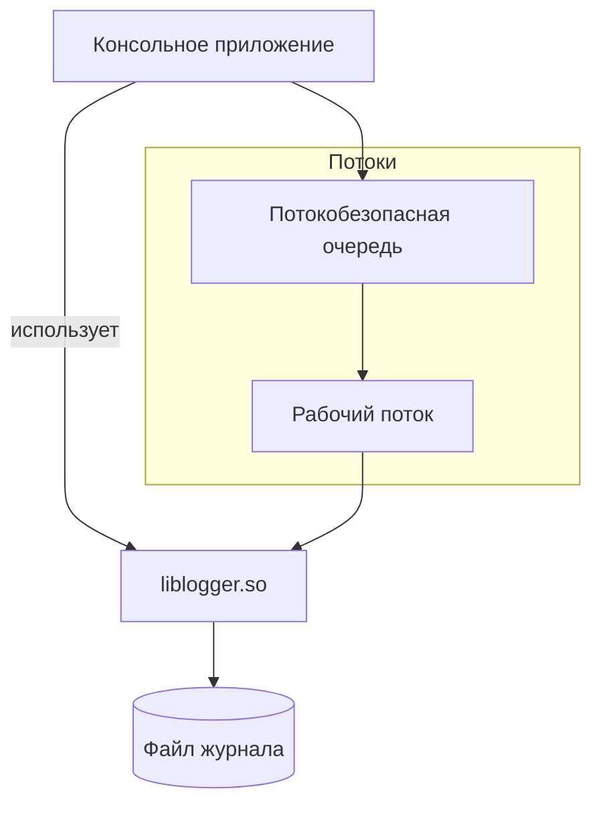
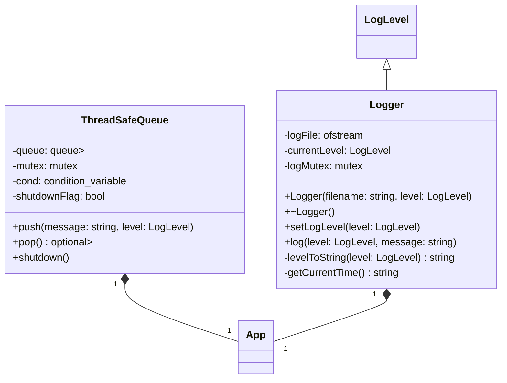
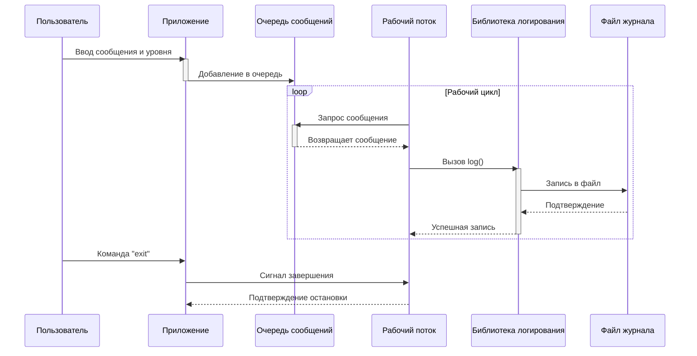

# 🪵 Advanced Logging System - C++

## Профессиональная система логирования с поддержкой многопоточности и динамической библиотекой


## 🚀 Особенности

- **Динамическая библиотека** логирования (`liblogger.so`)
- **4 уровня важности**: DEBUG, INFO, WARNING, ERROR
- **Многопоточная обработка** сообщений
- Потокобезопасная реализация
- Гибкая настройка уровня логирования
- Детальная информация в записях: время, уровень, сообщение
- Простая интеграция через Makefile

## 📦 Установка и сборка

```bash
# Клонирование репозитория
git clone https://github.com/yourusername/logging-system.git
cd logging-system

# Сборка проекта
make

# Запуск приложения
LD_LIBRARY_PATH=. ./logger_app log.txt INFO
```

## 🖥 Использование

```text
Logger started. Type 'exit' to quit.
Enter message: Application initialized
Enter log level (optional): 
Enter message: Low memory warning
Enter log level (optional): WARNING
Enter message: Database connection failed
Enter log level (optional): ERROR
Enter message: exit
```

Пример файла журнала (`log.txt`):
```text
2023-10-15 14:30:22 [INFO] Application initialized
2023-10-15 14:30:25 [WARNING] Low memory warning
2023-10-15 14:30:29 [ERROR] Database connection failed
```

## 🧩 Структура проекта

| Файл                | Описание                          |
|---------------------|-----------------------------------|
| `include/logger.h`  | Заголовочный файл библиотеки      |
| `src/logger.cpp`    | Реализация библиотеки логирования |
| `src/app.cpp`       | Многопоточное консольное приложение |
| `Makefile`          | Система сборки проекта            |

## 🔧 Технические детали

- **Стандарт языка**: C++17
- **Компилятор**: GCC (g++)
- **ОС**: Linux (Ubuntu/Debian)
- **Зависимости**: Только STL

## 📄 Лицензия

Проект распространяется под лицензией MIT. Подробнее см. в [LICENSE](LICENSE).

# Архитектура:



# Ключевые моменты:

Динамическая библиотека: .so файл, загружаемый в runtime

Потокобезопасность: мьютексы + условные переменные

RAII: автоматическое управление ресурсами (файлами, потоками)

Обработка ошибок: исключения + проверки состояния

C++17: std::optional, лямбды, structured bindings

# Структура библиотеки



# Процесс работы:


    
