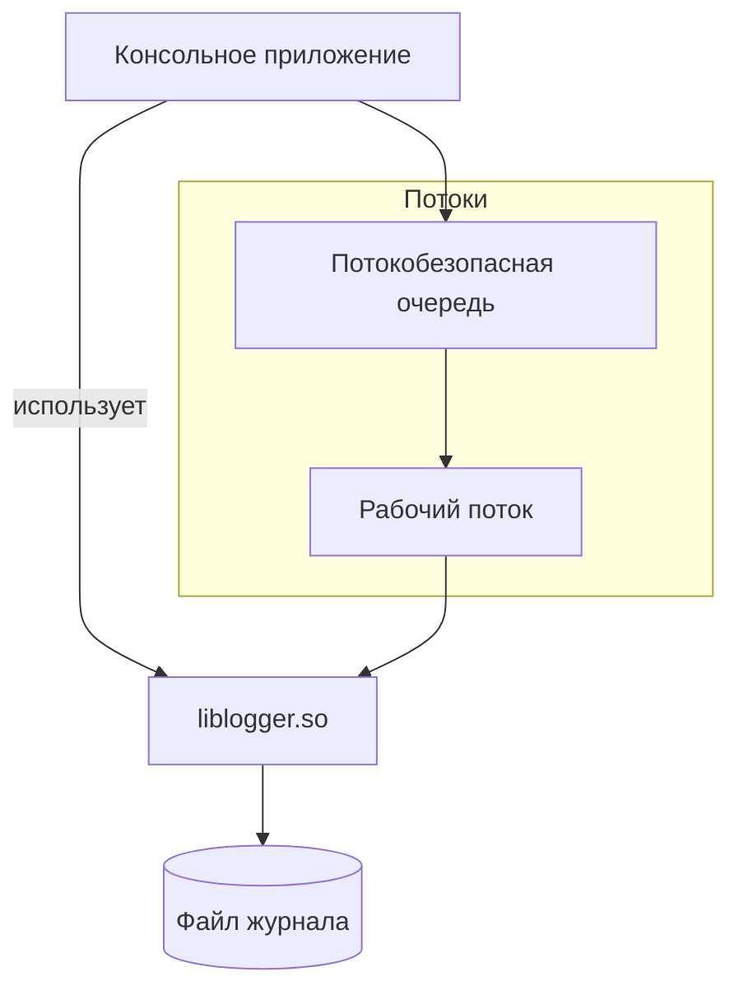
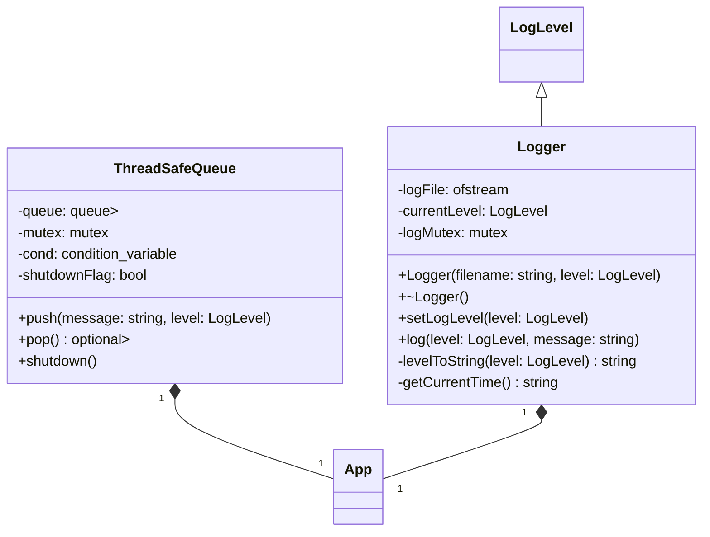
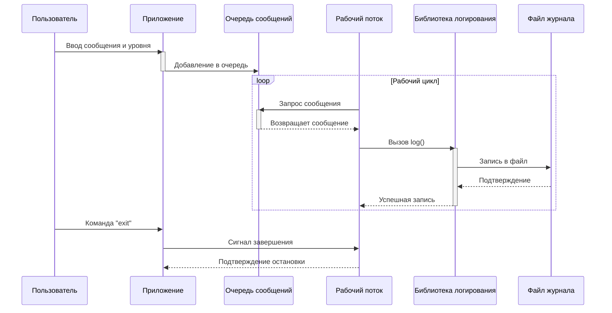

# Архитектура:

# Ключевые моменты:

Динамическая библиотека: .so файл, загружаемый в runtime

Потокобезопасность: мьютексы + условные переменные

RAII: автоматическое управление ресурсами (файлами, потоками)

Обработка ошибок: исключения + проверки состояния

C++17: std::optional, лямбды, structured bindings

# Структура библиотеки

# Процесс работы:

    
# Команды для демонстрации:

bash
# Показать сборку
make clean && make

# Показать работу
./logger_app demo.log DEBUG

# Показать содержимое лога
tail -f demo.log
